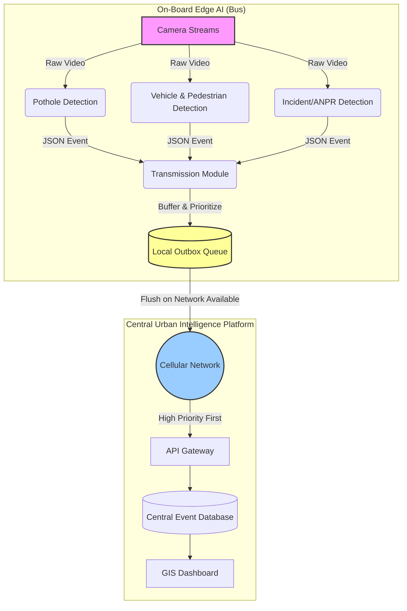

# Bandwidth-Minimization Architecture

This diagram illustrates the edge-only event-triggered architecture that ensures raw video stays on the bus, and only priority-ordered, compact JSON events are transmitted over the cellular network.

### Key Principles
1. **Edge-only processing**: Video never hits a transmit queue. The AI models consume frames in real-time on the device and discard them.
2. **Event-triggered**: `TransmissionQueue` only fires when an anomaly or count is detected.
3. **Offline Buffering**: Events queue in `outbox/` when connection is lost, preventing data loss.
4. **Priority Ordering**: Incidents (like `incident_hitandrun`) are pulled from the queue and sent before routine infrastructure updates.
